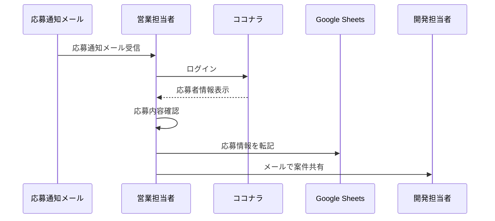
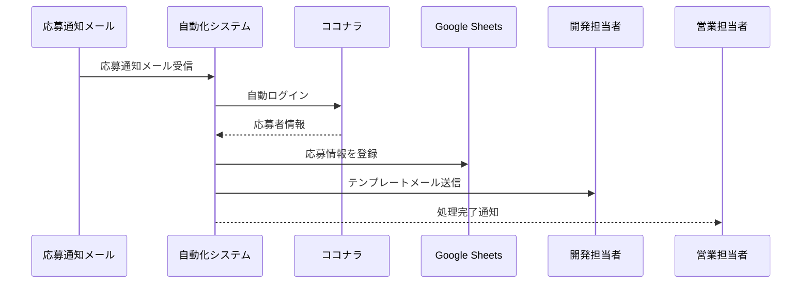

# 仮想案件定義

## 背景

当社では、Web制作やシステム開発案件を受注した際、一部の開発業務を**ココナラ**を利用して外部パートナーへ委託している。

案件ごとに必要なスキルが異なるため、Reactエンジニア、WordPressエンジニア、デザイナーなどを案件単位で募集している。

しかし、応募者の確認から社内共有までの業務を手作業で行っており、案件数の増加に伴い運用負荷が高くなっている。

そのため、本システムでは応募通知の受信から応募者情報の取得、社内共有までを自動化し、業務効率化を図る。

---

## 当社の運用構造

当社では、ココナラのアカウントを営業担当者1名が管理している。

営業担当者は以下の業務を担当している。

* 案件募集の掲載
* 応募者の確認
* 応募内容の一次確認
* 開発担当者への情報共有

ココナラで応募が発生すると、営業担当者のメールアドレス宛に通知メールが送信される。

通知メールには応募があったことは記載されているが、応募者の詳細情報や提案内容を確認するためにはココナラへログインする必要がある。

---

## 現在の業務フロー

営業担当者は応募通知メールを受信すると、以下の作業を行っている。

### ① 応募通知メールを確認

例：
```text
件名：
【ココナラ】募集案件に新しい応募がありました

本文：

案件名：Reactによる管理画面開発

応募者：
山田 太郎

応募ID：
12345678

応募内容の詳細は以下よりご確認できます。
https://XXXXXXXXXXXXXXXXXXXXXXXXXXXXXXX
```

---

### ② ココナラへログイン

通知メールを確認後、メール内に記載の応募詳細URLからココナラへログインする。

---

### ③ 応募者情報を確認

応募詳細画面を開き、以下の情報を確認する。

* 応募者名
* 実績件数
* 評価
* 提案金額
* 提案内容
* ポートフォリオ

例：
```text
案件名：
Reactによる管理画面開発

応募者：
山田 太郎

評価：
★4.9

実績：
120件

提案金額：
50,000円

提案内容：
ReactおよびTypeScriptを用いた業務システム開発経験があります。
```

---

### ④ スプレッドシートへ転記

取得した応募者情報を応募者管理台帳（Googleスプレッドシート）へ自動登録する。

登録項目は以下のとおり。

| 案件名            | 応募者名 | 評価  | 実績件数 | 提案金額    | 提案内容                               |
| -------------- | ---- | --- | ---- | ------- | ---------------------------------- |
| Reactによる管理画面開発 | 山田太郎 | 4.9 | 120件 | 50,000円 | React・TypeScriptによる業務システム開発経験があります |
| WordPressサイト制作 | 佐藤花子 | 4.8 | 85件  | 30,000円 | WordPressテーマ開発経験があります              |


---

### ⑤ 開発担当者へ共有

案件内容に応じて担当者へメールを送信する。

例：

React案件
→ フロントエンド担当

WordPress案件
→ Web制作担当

デザイン案件
→ デザイン担当

---

## 課題

現在の運用では以下の課題が発生している。

* 応募のたびに手動でココナラにログインする必要がある
* 応募情報を手動で転記している
* 転記ミスが発生する可能性がある
* 案件数が増えるほど対応工数が増加する
* 情報共有が営業担当者に依存している

---

## 対応策（スクレイピングの必要性）

上記課題を解決するため、本システムではスクレイピングを利用して応募情報の取得を自動化する。

### ① メール受信をトリガーとして処理開始

応募通知メールを受信したことを検知する。

### ② ココナラへ自動ログイン

SeleniumまたはPlaywrightを利用して管理画面へログインする。

### ③ 応募者情報を取得

応募詳細画面から以下の情報を取得する。

* 案件名
* 応募者名
* 評価
* 実績件数
* 提案金額
* 提案内容

### ④ スプレッドシートへ転記

取得した応募者情報を応募者管理台帳（Googleスプレッドシート）へ自動登録する。

登録項目は以下のとおり。

| 案件名            | 応募者名 | 評価  | 実績件数 | 提案金額    | 提案内容                               |
| -------------- | ---- | --- | ---- | ------- | ---------------------------------- |
| Reactによる管理画面開発 | 山田太郎 | 4.9 | 120件 | 50,000円 | React・TypeScriptによる業務システム開発経験があります |
| WordPressサイト制作 | 佐藤花子 | 4.8 | 85件  | 30,000円 | WordPressテーマ開発経験があります              |

### ⑤ 開発担当者へ通知

案件ジャンルに応じて担当者へ自動通知する。

---

## 業務フロー
本システムにより、営業担当者による転記作業や情報共有作業を削減し、応募受付から担当者への連携までを自動化できる。

### 現状フロー（手動）



---

### 改善後フロー（自動化）


